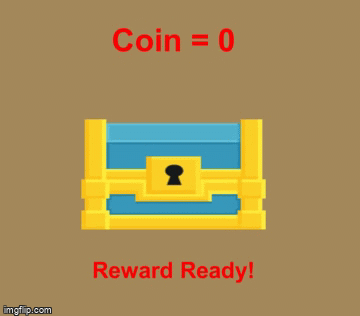
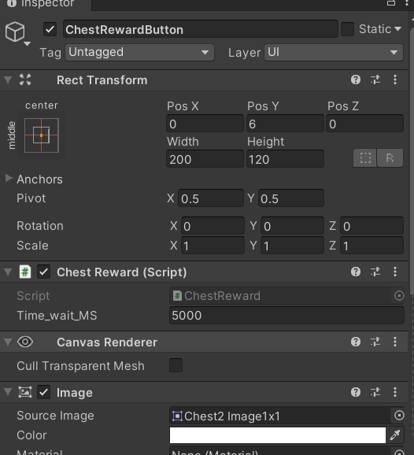
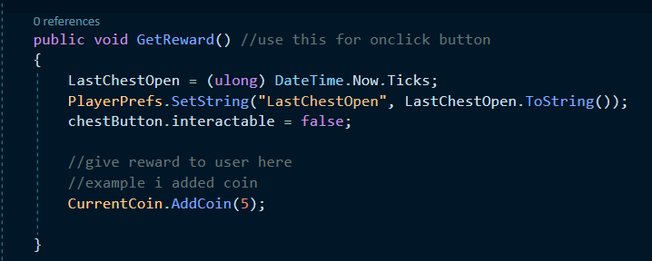

# Chest-Reward-System
 

# How to Use

Add ChestReward.cs into your chest button, and set the time wait. for example : i set the timer 5000 (5000 = 5 seconds)

then, dont forget to add a onclick function into your chest button.

GOOD LUCK!!!
